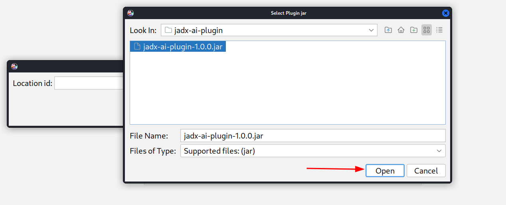

# JADX-AI


[](http://www.apache.org/licenses/LICENSE-2.0.html)

> It is a still in early stage of development, so expects bugs, crashes and logical erros.

> Standalone Plugin for [JADX](https://github.com/skylot/jadx) (Started as Fork) with Model Context Protocol (MCP) integration for AI-powered static code analysis and real-time code review and reverse engineering tasks using Claude.

 Image generated using AI tools.

---

## 🤖 What is JADX-AI?

**JADX-AI** is a plugin for the [JADX decompiler](https://github.com/skylot/jadx) that integrates directly with [Model Context Protocol (MCP)](https://github.com/anthropic/mcp) to provide **live reverse engineering support with LLMs like Claude**.

Think: "Decompile → Context-Aware Code Review → AI Recommendations" — all in real time.

Watch the demo!

[](https://www.youtube.com/watch?v=Od86IOkkaHg&autoplay=1)

It is combination of two tools:
1. JADX-AI
2. [JADX MCP SERVER](https://github.com/zinja-coder/jadx-mcp-server)

## 🤖 What is JADX-MCP-SERVER?

**JADX MCP Server** is a standalone Python server that interacts with a `JADX-AI` plugin (see: [jadx-ai](https://github.com/zinja-coder/jadx-ai)) via MCP (Model Context Protocol). It lets LLMs communicate with the decompiled Android app context live.

## Current MCP Tools

The following MCP tools are available:

- `fetch_current_class()` — Get the class name and full source of selected class
- `get_selected_text()` — Get currently selected text
- `get_all_classes()` — List all classes in the project
- `get_class_source(class_name)` — Get full source of a given class
- `get_method_by_name(class_name, method_name)` — Fetch a method’s source
- `search_method_by_name(method_name)` — Search method across classes
- `get_methods_of_class(class_name)` — List methods in a class
- `get_fields_of_class(class_name)` — List fields in a class
- `get_method_code(class_name, method_name)` — Alias for `get_method_by_name` //to be removed
- `get_smali_of_class(class_name)` — Fetch smali of class

---

## 🗒️ Sample Prompts

🔍 Basic Code Understanding

    "Explain what this class does in one paragraph."

    "Summarize the responsibilities of this method."

    "Is there any obfuscation in this class?"

    "List all Android permissions this class might require."

🛡️ Vulnerability Detection

    "Are there any insecure API usages in this method?"

    "Check this class for hardcoded secrets or credentials."

    "Does this method sanitize user input before using it?"

    "What security vulnerabilities might be introduced by this code?"

🛠️ Reverse Engineering Helpers

    "Deobfuscate and rename the classes and methods to something readable."

    "Can you infer the original purpose of this smali method?"

    "What libraries or SDKs does this class appear to be part of?"

📦 Static Analysis

    "List all network-related API calls in this class."

    "Identify file I/O operations and their potential risks."

    "Does this method leak device info or PII?"

🤖 AI Code Modification

    "Refactor this method to improve readability."

    "Add comments to this code explaining each step."

    "Rewrite this Java method in Python for analysis."

📄 Documentation & Metadata

    "Generate Javadoc-style comments for all methods."

    "What package or app component does this class likely belong to?"

    "Can you identify the Android component type (Activity, Service, etc.)?"
---

## 📦 Features

- ✅ MCP server baked into JADX-GUI
- ✅ Exposes currently selected class via HTTP
- ✅ Exposes GUI access to Cluade, i.e. "Explain the selected code to me, Explain what is the use case of highlighted code"
- ✅ Built-in Claude Desktop integration
- ✅ Beta support for real-time code review
- ✅ MCP client interoperability via local loopback

---

## 🛠️ Getting Started

### 1. Downlaod from Releases: https://github.com/zinja-coder/jadx-ai/releases

```bash
# 1. Unzip the jadx-ai-<version>.zip
unzip jadx-ai-<version>.zip

jadx-mcp-server/
├── jadx_mcp.py
├── requirements.txt
├── README.md
├── LICENSE
jadx-ai/
├── jadx-ai-plugin<version>.jar

# 2. Install the plugin
```




```bash
# 3. Navigate to jadx_mcp_server directory
cd jadx_mcp_server

# 4. This project uses uv - https://github.com/astral-sh/uv instead of pip for dependency management.
    ## a. Install uv (if you dont have it yet)
curl -LsSf https://astral.sh/uv/install.sh | sh
    ## b. Set up the environment
uv venv
source .venv/bin/activate  # or .venv\Scripts\activate on Windows
    ## c. Install dependencies
uv pip install httpx fastmcp

# The setup for jadx-ai and jadx_mcp_server is done.
```

## 🤖 2. Claude Desktop Setup

Make sure Claude Desktop is running with MCP enabled.

For instance, I have used following for Kali Linux: https://github.com/aaddrick/claude-desktop-debian

Configure and add MCP server to LLM file:
```bash
nano ~/.config/Claude/claude_desktop_config.json
```
And following content in it:
```json
{
    "mcpServers": {
        "jadx-mcp-server": {
            "command": "/home/<YOUR_USERNAME/.local/bin/uv",
            "args": [
                "--directory",
                "</PATH/TO/>jadx_mcp_server/",
                "run",
                "jadx_mcp.py"
            ]
        }
    }
}
```

Then, navigate code and interact via real-time code review prompts using the built-in integration.

## Give it a shot

1. Run jadx-gui and load any .apk file


2. Start claude - You must see hammer symbol


3. Click on the `hammer` symbol and you should you see somthing like following:


4. Run following prompt:
```text
fetch currently selected class and perform quick sast on it
```


5. Allow access when prompted:


6. HACK!


This plugin allows total control over the GUI and internal project model to support deeper LLM integration, including:

- Exporting selected class to MCP
- Running automated Claude analysis
- Receiving back suggestions inline

---

## 🛣️ Future Roadmap

 - Add Support for apktool

 - Add support for hermes code (ReactNative Application)

 - Add more useful MCP Tools

 - Make LLM be able to modify code on JADX

## NOTE For Contributors

 - The files related to JADX-AI can be found under this repo.

 - The files related to **jadx-mcp-server** can be found [here](https://github.com/zinja-coder/jadx-mcp-server).

## 🙏 Credits

This project is a plugin for JADX, an amazing open-source Android decompiler created and maintained by [@skylot](https://github.com/skylot). All core decompilation logic belongs to them. I have only extended it to support my MCP server with AI capabilities.

[📎 Original README (JADX)](https://github.com/skylot/jadx)

The original README.md from jadx is included here in this repository for reference and credit.

This MCP server is made possible by the extensibility of JADX-GUI and the amazing Android reverse engineering community.

Also huge thanks to [@aaddrick](https://github.com/aaddrick) for developing Claude desktop for Debian based linux.

## 📄 License

This plugin inherits the Apache 2.0 License from the original JADX repository.

## ⚖️ Legal Warning

**Disclaimer**

The tools `jadx-ai` and `jadx_mcp_server` are intended strictly for educational, research, and ethical security assessment purposes. They are provided "as-is" without any warranties, expressed or implied. Users are solely responsible for ensuring that their use of these tools complies with all applicable laws, regulations, and ethical guidelines.

By using `jadx-ai` or `jadx_mcp_server`, you agree to use them only in environments you are authorized to test, such as applications you own or have explicit permission to analyze. Any misuse of these tools for unauthorized reverse engineering, infringement of intellectual property rights, or malicious activity is strictly prohibited.

The developers of `jadx-ai` and `jadx_mcp_server` shall not be held liable for any damage, data loss, legal consequences, or other consequences resulting from the use or misuse of these tools. Users assume full responsibility for their actions and any impact caused by their usage.

Use responsibly. Respect intellectual property. Follow ethical hacking practices.

---

Built with ❤️ for the reverse engineering and AI communities.
